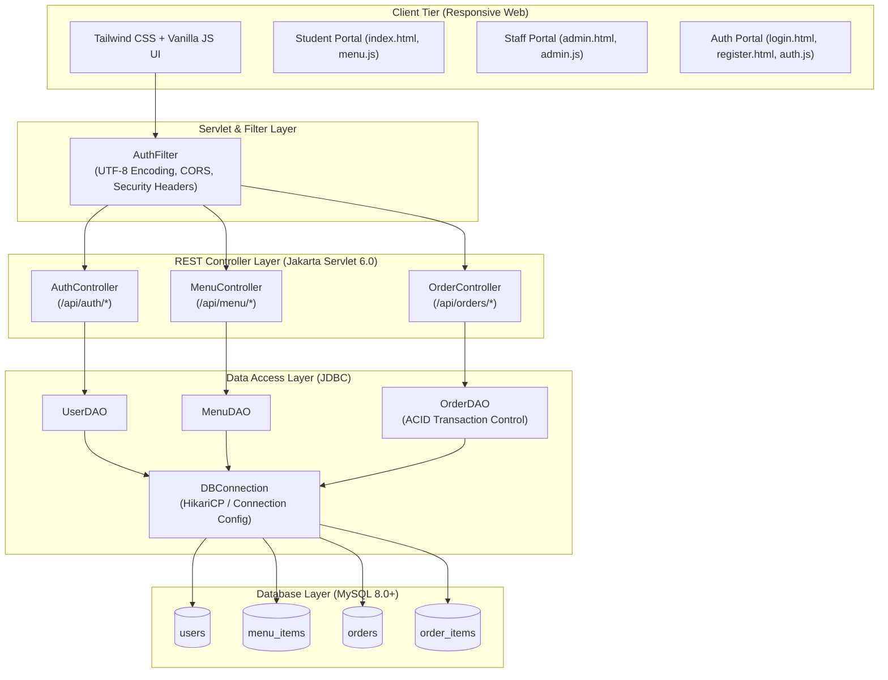
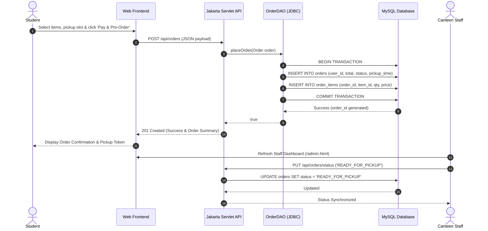
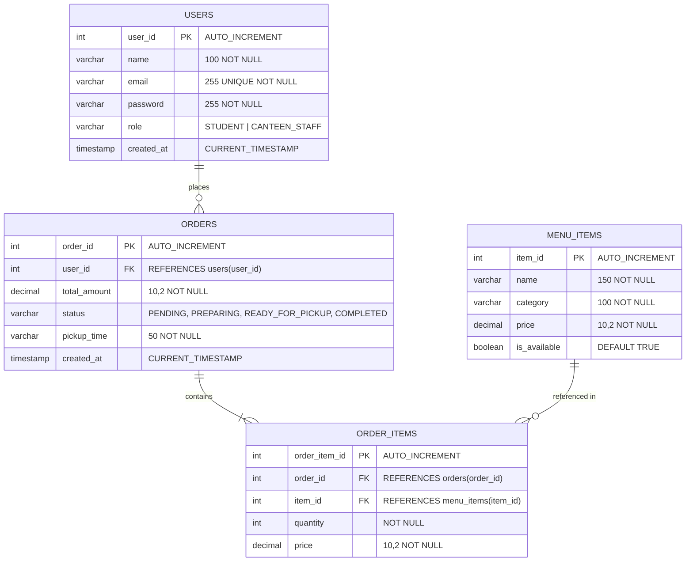

# 🍽️ CampusBite — Canteen Pre-Order & Kitchen Management System

<div align="center">

[](https://openjdk.org/)
[](https://jakarta.ee/)
[](https://maven.apache.org/)
[](https://www.mysql.com/)
[](https://tailwindcss.com/)
[](https://opensource.org/licenses/MIT)
[](https://github.com/MITHU-06/Canteen-Preorder-System/actions)

<p align="center">
  <b>A full-stack, enterprise-grade digital canteen pre-ordering and kitchen queue orchestration platform built to eliminate campus rush-hour queues and streamline food fulfillment.</b>
</p>

[Key Features](#-key-features) • [System Architecture](#-system-architecture) • [Database Design](#-database-schema--er-diagram) • [Quick Start](#-quick-start-guide) • [API Specification](#-api-endpoints) • [Contributing](#-contributing)

</div>

---

## 📌 Problem Statement & Solution

### The Challenge
Campus canteens and cafeterias face overwhelming congestion during fixed lunch breaks and intervals:
* **Severe Waiting Times**: Students and faculty spend 20–30 minutes waiting in line, leaving little time to eat.
* **Kitchen Chaos & Stock Imbalance**: Kitchen staff struggle with unpredictable spikes, causing stockouts of popular meals and overproduction of others.
* **Fragmented Cash & Order Tracking**: Manual token counters lead to delayed processing and mismatched orders.

### The CampusBite Solution
**CampusBite** transforms campus dining into a friction-free pre-order experience:
1. **Students** browse live digital menus, apply dietary filters (Veg/Non-Veg), customize scheduled pick-up slots, and place multi-item orders in advance.
2. **Canteen Staff & Admins** receive incoming orders in real-time, update status stages (`PENDING` ➔ `PREPARING` ➔ `READY_FOR_PICKUP` ➔ `COMPLETED`), and toggle item stock availability dynamically.
3. **Kitchen Operations** operate smoothly with predictable batch preparation and zero physical queue congestion.

---

## 🚀 Key Features

### 👤 Role-Based Authentication & Access Control
- Distinct permission boundaries for **Students** and **Canteen Staff**.
- Secure session state management and intelligent role-based routing (`/index.html` for students, `/admin.html` for staff).

### 🍲 Interactive Digital Menu & Smart Cart
- Categorized navigation: *Meals & Biryani*, *Snacks*, *Beverages & Desserts*.
- Instant dietary filtering (**Veg Only** / **Non-Veg Only**) with search and preparation time estimates.
- Dynamic cart drawer with real-time subtotal, taxes, packaging calculation, and interactive item adjustments.

### ⏰ Scheduled Time-Slot Pickup
- Selectable pickup windows: *Immediate*, *In 15 mins*, *In 30 mins*, *In 45 mins*, or *In 1 hour*.
- Smooth checkout modal with celebration effects, instant token generation, and order summary receipts.

### ⚡ Atomic Multi-Item Transaction Engine
- Multi-tier database transactions ensuring atomic insertion across `orders` and `order_items` tables with automatic rollback on failure.

### 🧑‍🍳 Canteen Staff Live Management Dashboard
- Live menu inventory control with single-click **Mark Available / Out of Stock** toggles.
- Real-time order queue monitoring and status transitions to inform students when food is ready.

### 📦 Dual Runtime Architecture
- **Standalone Java Mode (`Server.java`)**: Instant single-file development server on port 8080 with zero external container dependencies.
- **Enterprise Tomcat 10+ Container (`WAR`)**: Standard Jakarta EE 10 / Servlet 6.0 deployment artifact ready for production servers.

---

## 🏗️ System Architecture



---

## 🔄 User & Order Lifecycle Flow



---

## 🗄️ Database Schema & ER Diagram



---

## 💻 Tech Stack

| Layer | Technology | Description |
|---|---|---|
| **Backend Core** | Java 21 (LTS) | Modern Java language features, robust concurrency |
| **Servlet Standard** | Jakarta EE 10 / Servlet 6.0 | Industry-standard web API framework |
| **JSON Processing** | Jackson Databind 2.16.1 | High-performance JSON serialization & parsing |
| **Database** | MySQL 8.0+ | Relational persistence with InnoDB ACID transactions |
| **Driver** | MySQL Connector/J 8.4.0 | Official Type-4 JDBC Driver |
| **Frontend UI** | HTML5, Tailwind CSS, Vanilla JavaScript | Responsive glassmorphism UI with micro-interactions |
| **Icons & Effects** | FontAwesome 6, Canvas Confetti | Visual feedback and responsive delight |
| **Testing** | JUnit 5 Jupiter | Unit testing suite for data models and serialization |
| **Build & CI** | Apache Maven 3.9+, GitHub Actions | Automated dependency resolution, builds, and CI |

---

## 📂 Repository Structure

```text
Canteen-Preorder-System/
├── .github/
│   ├── workflows/
│   │   └── ci.yml               # GitHub Actions CI workflow (JDK 21 + Maven)
│   ├── ISSUE_TEMPLATE/
│   │   ├── bug_report.yml       # Structured bug submission form
│   │   ├── feature_request.yml  # Feature proposal template
│   │   └── config.yml           # Community links configuration
│   ├── dependabot.yml           # Automated Maven & Actions dependency updates
│   └── PULL_REQUEST_TEMPLATE.md # Standardized PR review checklist
├── docs/
│   ├── ARCHITECTURE.md          # In-depth architectural & data flow documentation
│   ├── API.md                   # REST API endpoints & JSON payloads
│   └── DATABASE.md              # Database schemas, ER diagram & indexing
├── sql/
│   └── schema.sql               # MySQL database tables, constraints & seed data
├── src/
│   ├── main/
│   │   ├── java/com/canteen/
│   │   │   ├── config/
│   │   │   │   └── DBConnection.java     # JDBC connection factory & ENV overrides
│   │   │   ├── controller/
│   │   │   │   ├── AuthController.java   # /api/auth/register & /api/auth/login
│   │   │   │   ├── MenuController.java   # /api/menu & /api/menu/availability
│   │   │   │   └── OrderController.java  # /api/orders (place, fetch, update status)
│   │   │   ├── dao/
│   │   │   │   ├── UserDAO.java          # User registration and authentication queries
│   │   │   │   ├── MenuDAO.java          # Menu retrieval and stock toggle queries
│   │   │   │   └── OrderDAO.java         # Atomic order & item transaction management
│   │   │   ├── filter/
│   │   │   │   └── AuthFilter.java       # UTF-8 encoding, CORS & security header filter
│   │   │   └── model/
│   │   │       ├── User.java             # User entity model
│   │   │       ├── MenuItem.java         # Menu item entity model
│   │   │       ├── Order.java            # Order entity model
│   │   │       └── OrderItem.java        # Order line item entity model
│   │   ├── resources/
│   │   │   └── db.properties             # Database connection credentials config
│   │   └── webapp/
│   │       ├── index.html                # Student ordering portal & interactive cart
│   │       ├── login.html                # User login page
│   │       ├── register.html             # User registration page
│   │       ├── admin.html                # Canteen staff management dashboard
│   │       ├── css/style.css             # Custom styles & animation utilities
│   │       ├── js/
│   │       │   ├── auth.js               # Client auth handling & session storage
│   │       │   ├── menu.js               # Menu rendering, cart, and checkout logic
│   │       │   └── admin.js              # Staff inventory & order status controllers
│   │       └── images/                   # High-resolution food assets & backgrounds
│   └── test/
│       └── java/com/canteen/model/
│           └── ModelTest.java            # JUnit 5 unit tests for models & JSON mapping
├── .env.example                         # Safe environment variable configuration template
├── .gitignore                           # Comprehensive exclusions for Java/Maven/IDEs/OS
├── CHANGELOG.md                         # Release notes and version history
├── CONTRIBUTING.md                      # Contributor guidelines and workflow
├── LICENSE                              # MIT License
├── MYSQL_SETUP.md                       # MySQL step-by-step installation instructions
├── Server.java                          # Standalone development HTTP server
└── pom.xml                              # Maven project descriptor and dependencies
```

---

## ⚡ Quick Start Guide

### Prerequisites
- **Java 21+** (`java -version`)
- **Apache Maven 3.8+** (`mvn -version`)
- **MySQL Server 8.0+** (`mysql -version`)

---

### Step 1: Clone the Repository
```bash
git clone https://github.com/MITHU-06/Canteen-Preorder-System.git
cd Canteen-Preorder-System
```

---

### Step 2: Set Up MySQL Database
1. Open your terminal or MySQL Workbench:
```bash
mysql -u root -p
```
2. Execute the schema file:
```sql
SOURCE sql/schema.sql;
```
*(Or import `sql/schema.sql` directly into MySQL Workbench).*

---

### Step 3: Configure Database Credentials
Configure database credentials via environment variables or edit `src/main/resources/db.properties`:

**Option A (Recommended — Environment Variables):**
```bash
export DB_URL="jdbc:mysql://localhost:3306/canteen_db?useSSL=false&allowPublicKeyRetrieval=true&serverTimezone=Asia/Kolkata"
export DB_USER="root"
export DB_PASSWORD="YOUR_ACTUAL_MYSQL_PASSWORD"
```

**Option B (Configuration File):**
Edit `src/main/resources/db.properties`:
```properties
db.url=jdbc:mysql://localhost:3306/canteen_db?useSSL=false&allowPublicKeyRetrieval=true&serverTimezone=Asia/Kolkata
db.user=root
db.password=YOUR_ACTUAL_MYSQL_PASSWORD
db.driver=com.mysql.cj.jdbc.Driver
```

---

### Step 4: Run the Application

#### Option 1: Standalone Java Server (Fastest for Development)
Run directly with `java`:
```bash
# Compile and start
javac -cp "target/classes:target/canteen-preorder-system/WEB-INF/lib/*:." Server.java
java -cp "target/classes:target/canteen-preorder-system/WEB-INF/lib/*:." Server
```
*Open your browser at:* **`http://localhost:8080/login.html`**

#### Option 2: Apache Tomcat 10+ (Enterprise WAR Deployment)
1. Build the production WAR package:
```bash
mvn clean package
```
2. Copy `target/canteen-preorder-system.war` to your Tomcat `webapps/` folder:
```bash
cp target/canteen-preorder-system.war $CATALINA_HOME/webapps/
```
3. Start Apache Tomcat:
```bash
$CATALINA_HOME/bin/startup.sh   # (startup.bat on Windows)
```
*Open your browser at:* **`http://localhost:8080/canteen-preorder-system/`**

---

## 🧪 Running Unit Tests

Execute the automated test suite with Maven:
```bash
mvn clean test
```

Expected output:
```text
[INFO] Running com.canteen.model.ModelTest
[INFO] Tests run: 3, Failures: 0, Errors: 0, Skipped: 0
[INFO] BUILD SUCCESS
```

---

## 🔌 API Endpoints Summary

For complete JSON request and response payloads, see [docs/API.md](docs/API.md).

| Method | Endpoint | Description | Access |
|---|---|---|---|
| `POST` | `/api/auth/register` | Register a new student or staff account | Public |
| `POST` | `/api/auth/login` | Authenticate user and initiate session | Public |
| `GET` | `/api/menu` | Retrieve all currently available menu items | Student / Public |
| `GET` | `/api/menu/all` | Retrieve all menu items (including out-of-stock) | Staff / Admin |
| `PUT` | `/api/menu/availability` | Toggle item availability (`isAvailable: boolean`) | Staff / Admin |
| `POST` | `/api/orders` | Place a new pre-order with line items | Authenticated |
| `GET` | `/api/orders?userId={id}` | Retrieve order history for a specific user | Authenticated |
| `PUT` | `/api/orders/status` | Advance order status (`PENDING` ➔ `READY_FOR_PICKUP`) | Staff / Admin |

---

## 🗺️ Roadmap & Future Enhancements

- [x] Student and Canteen Staff Role-Based Authentication
- [x] Dynamic Menu with Dietary & Category Filters
- [x] Real-Time Interactive Cart & Custom Time-Slot Pickup
- [x] Atomic Transactional Multi-Item Pre-Ordering
- [x] Staff Inventory Toggle & Order Status Controls
- [x] JUnit 5 Test Suite and GitHub Actions CI Pipeline
- [ ] WebSocket integration for real-time order readiness push notifications
- [ ] Online Payment Gateway Integration (Razorpay / Stripe)
- [ ] QR Code generation for one-scan fast pickup verification at the counter
- [ ] Daily analytics dashboard for canteen administrators (peak hours, top-selling items)

---

## 🤝 Contributing

Contributions are what make the open-source community an incredible place to learn, inspire, and create. Any contributions you make are **greatly appreciated**.

Please see our [CONTRIBUTING.md](CONTRIBUTING.md) guide for setup instructions and commit conventions.

---

## 🔒 Security

We take security seriously. Please review our [SECURITY.md](SECURITY.md) policy for instructions on reporting vulnerabilities.

---

## 📄 License

This project is licensed under the **MIT License** - see the [LICENSE](LICENSE) file for details.

---

<div align="center">
  <sub>Developed with ❤️ by <a href="https://github.com/MITHU-06">MITHU-06</a> for campus dining optimization.</sub>
</div>
