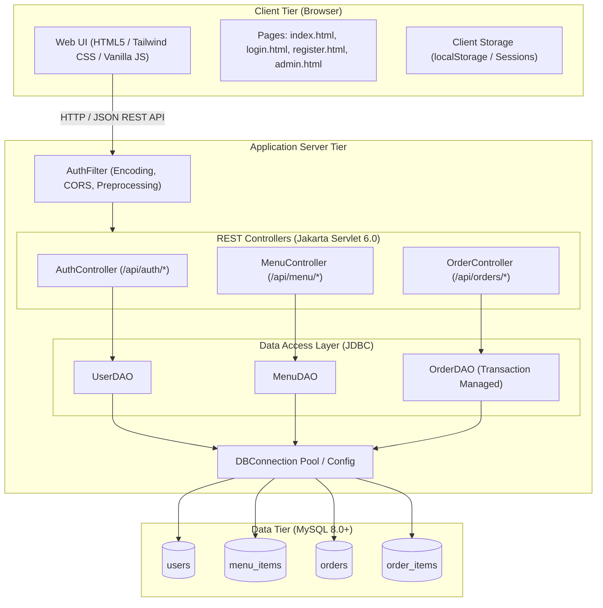
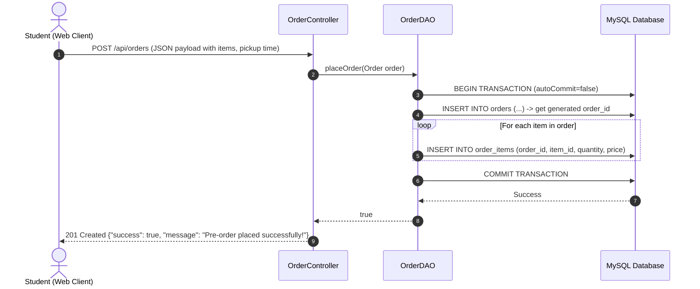

# CampusBite Architecture Documentation

This document describes the high-level architecture, module decomposition, and data flow of the **CampusBite - Canteen Pre-Order System**.

---

## 1. High-Level System Architecture

---

## 2. Order Placement & Transaction Lifecycle

When a student submits an order, the system executes an atomic database transaction:

---

## 3. Dual Execution Modes

CampusBite supports two flexible deployment and execution paradigms:

1. **Standalone Development Mode (`Server.java`)**:
   - Uses Java's lightweight built-in HTTP server (`com.sun.net.httpserver.HttpServer`).
   - Serves static web assets and handles login/registration endpoints directly on port 8080 without requiring an external container.
   
2. **Production Enterprise Container (`WAR` / Tomcat 10+)**:
   - Built using Maven standard WAR packaging (`canteen-preorder-system.war`).
   - Runs in Apache Tomcat 10+ using standard Jakarta EE 10 / Servlet 6.0 annotations (`@WebServlet`, `@WebFilter`).
