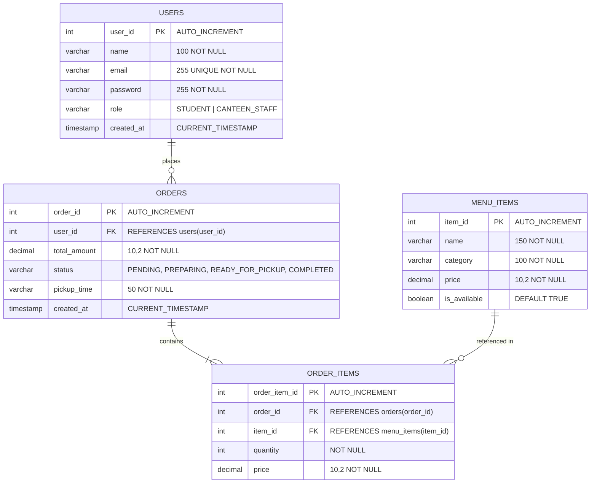

# CampusBite Database Documentation

The system uses **MySQL 8.0+** with the InnoDB storage engine, leveraging foreign keys and ACID transactional integrity for financial and inventory transactions.

---

## 1. Entity-Relationship (ER) Diagram



---

## 2. Table Specifications

### `users`
Stores student and staff credentials with role-based access flags.

### `menu_items`
Stores the active canteen menu, pricing, category classification, and live availability status.

### `orders`
Header table for each pre-order with status tracking (`PENDING`, `PREPARING`, `READY_FOR_PICKUP`, `COMPLETED`, `CANCELLED`) and targeted pickup time.

### `order_items`
Line item details for each order, capturing frozen price-at-order and quantity.

---

## 3. Database Initialization

Execute the schema script located in `sql/schema.sql`:

```bash
mysql -u root -p < sql/schema.sql
```
